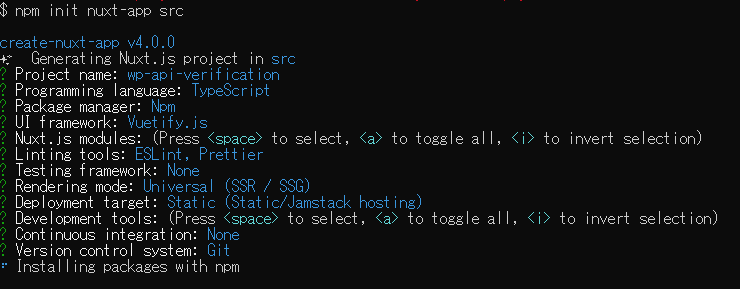
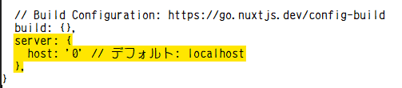

v## 概要

Dockerを用いて、WordPressとNuxt.jsのイメージを作成し、ヘッドレス運用するためのDockerfileを用意する

## 作業手順

### 1. WordPressのセットアップ
#### 1.1. リポジトリのクローン

#### 1.2. ディレクトリに移動し、Dockerイメージをビルド

``` bash

docker build -t nodewordpress .
```

#### 1.3. コンテナを起動


``` bash
docker-compose up -d --build
```

#### 1.4. WordPressの初期設定をコマンドで実施

``` bash
docker exec wordpress wp core install --url=localhost --title='WordPress Sitee' --admin_user=admin --admin_email=itezora.nonoha@gmail.com --allow-root
```

この後、Admin Passwordが表示されるので、一応退避させておくと良いかも。


### 2. 動作確認用のダミー記事を投入する
#### 2.1. コンテナに入る

``` bash
docker exec - it  wordpress /bin/bash
```

#### 2.2. プラグインをインストール

``` bash
wp plugin install wordpress-importer --activate --allow-root
```

#### 2.3. ダミー記事を取得

``` bash
curl -O https://raw.githubusercontent.com/WPTRT/theme-unit-test/master/themeunittestdata.wordpress.xml
```

#### 2.4. ダミー記事を投入

``` bash
wp import themeunittestdata.wordpress.xml --authors=create --allow-root
```

> 2分くらい掛かる

### 3. Nuxt.jsのセットアップ

#### 3.1. Node.jsのコンテナに入る

``` bash
docker-compose exec nuxtjs bash
```

#### 3.2. Nuxt.jsのインストール

``` bash
npm install create-nuxt-app
```

#### 3.3. Nuxt.jsのプロジェクトを作成

``` bash
npm init nuxt-app src
```

> (*1) `src`はディレクトリ名。
>   設定は以下のようにした。（細かいところは煮詰めていないため、変更の余地あり）
>   
> (*2) Git Bashからコンテナに入るとうまく操作できなかったため、Docker Desktopからコンソールを立ち上げ、実行した
> (*3) `🎉  Successfully created project wp-api-verification`が出れば完了
> (*4) プロジェクトの作成には5～10分掛かる

#### 3.4. Dockerで動かすためにコンフィグを調整

- nuxt.config.js の内容に下記を追加し、別のコンテナからアクセスできるようにする

``` txt
  server: {
    host: '0'
  }
```



> 参照：https://nuxtjs.org/ja/docs/features/configuration/#%E3%83%9B%E3%82%B9%E3%83%88%E3%81%A8%E3%83%9D%E3%83%BC%E3%83%88%E7%95%AA%E5%8F%B7%E3%82%92%E7%B7%A8%E9%9B%86%E3%81%99%E3%82%8B

axiosを用いる場合は、下記も追加する。
``` txt
  modules: [
    "@nuxtjs/axios",
	],
```

ホットリロード機能を有効にするため、下記も追加する。（Dockerを使用している場合は、追記しないとホットリロードが有効にならないため）

``` txt
  watchers: {
    webpack: {
      poll: true
    }
  },
```

> 参照：https://sunday-morning.app/posts/2020-11-30-docker-nuxt-js-hot-reload

#### 3.5. axiosのインストール

```
npm install --save @nuxtjs/axios
```

#### 3.6. Nuxt.jsアプリを実行

``` bash
cd src
npm run dev
```

> 3分くらいで起動が完了する。停止するときはCtrl+C
